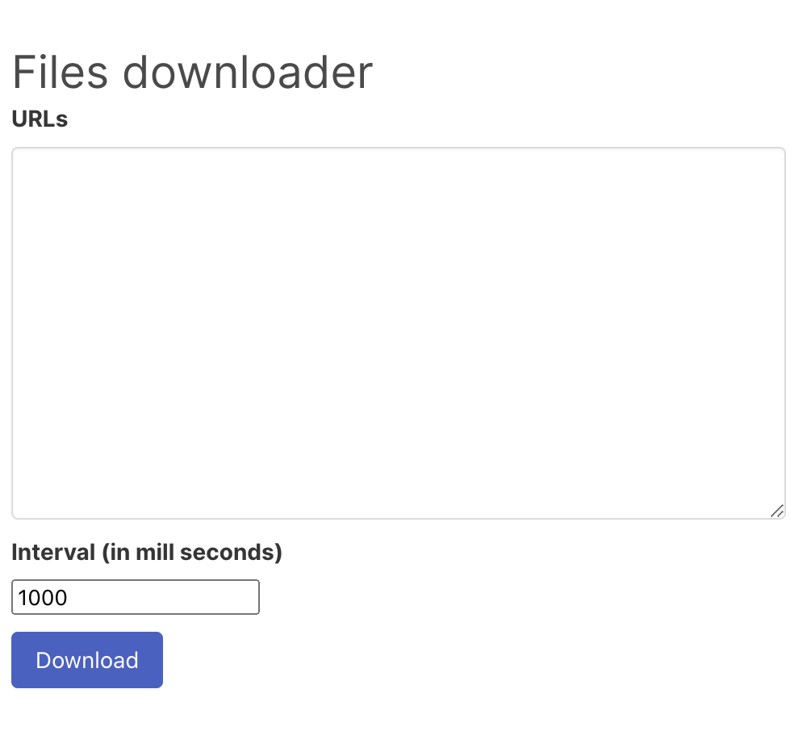

# files-downloader

A web extension to download files via your active tab.

## How to use

- Download the latest release
- [Load an unpacked extension](https://developer.chrome.com/docs/extensions/mv3/getstarted/#unpacked)
